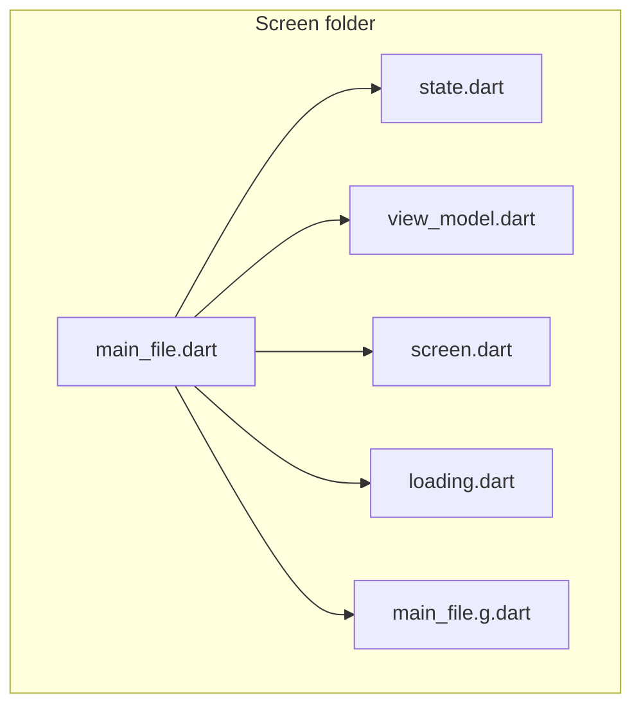

# Flutter Screen Structure Documentation

## 1. Folder Structure

Each screen lives in its own folder within
`lib/features/{feature}/presentation/screens/{screen_name}/`. Files follow the
`library` + `part` pattern (a main file that groups all parts).

### File Structure (Settings)

```
settings/
├── settings.dart      # Main file (library) with imports and part directives
├── state.dart         # part: SettingsState
├── view_model.dart    # part: SettingsViewModel
├── screen.dart        # part: SettingsScreen
└── settings.g.dart    # Generated: settingsViewModelProvider
```

### File Structure (Home - includes optional component)

```
home/
├── home.dart          # Main file (library)
├── state.dart         # part: HomeState
├── view_model.dart    # part: HomeViewModel
├── screen.dart        # part: HomeScreen
├── loading.dart       # part: LoadingHome (optional loading widget)
└── home.g.dart        # Generated: homeViewModelProvider
```

### Dependency Diagram



---

## 2. Main File (library)

### Description

The main file (e.g. `home.dart`) acts as the screen's entry point. It declares
the library, centralizes imports, and groups all parts via `part` directives.

### Content

- `library;` declaration
- Project imports
- Part directives in recommended order: `.g.dart`, `screen.dart`, `state.dart`,
  `view_model.dart`, `loading.dart` (optional)

```dart
// lib/features/home/presentation/screens/home/home.dart
library;

import 'package:base/core/extensions/extensions.dart';
import 'package:base/typing/extensions/extensions.dart';
import 'package:base/ui/widgets/atoms/atoms.dart';
import 'package:base/ui/ions/ions.dart';
import 'package:flutter/material.dart' hide Colors;
import 'package:flutter_riverpod/flutter_riverpod.dart';
import 'package:riverpod_annotation/riverpod_annotation.dart';

import '../../../../../typing/result/result.dart';
import '../../../../../ui/routes/routes.dart';
import '../../../../../ui/l10n/generated/l10n.dart';
import '../../../domain/dependencies/dependencies.dart';

part 'home.g.dart';
part 'state.dart';
part 'screen.dart';
part 'view_model.dart';
```

---

## 3. State File (state.dart)

### Description

Defines the screen's immutable state. It is a `part` of the main file and
contains the state class with its variables, initial factory, and `copyWith`
method.

### Content

1. **State Class (e.g. HomeState):**
   - Final variables for the state
   - `initial()` factory for default values
   - `copyWith` method for immutable copies
   - Optionally: `UIEvent<dynamic>?` for UI events (loading, navigation,
     snackbars)

```dart
part of 'home.dart';

class HomeState {
  final bool isCorrectGet;
  final int clicks;

  HomeState({required this.isCorrectGet, required this.clicks});

  factory HomeState.initial() => HomeState(isCorrectGet: false, clicks: 0);

  HomeState copyWith({bool? isCorrectGet, int? clicks}) => HomeState(
    isCorrectGet: isCorrectGet ?? this.isCorrectGet,
    clicks: clicks ?? this.clicks,
  );
}
```

### State with UIEvent (optional)

```dart
class ExampleState {
  final bool isLoading;
  final UIEvent<dynamic>? event;

  ExampleState({required this.isLoading, this.event});
  factory ExampleState.initial() => ExampleState(isLoading: false);

  ExampleState copyWith({bool? isLoading, UIEvent<dynamic>? event}) =>
      ExampleState(
        isLoading: isLoading ?? this.isLoading,
        event: event ?? this.event,
      );
}
```

---

## 4. ViewModel File (view_model.dart)

### Description

Contains the screen logic. Uses the `@riverpod` or `@Riverpod(keepAlive: true)`
annotation and extends the generated class `_$ScreenViewModel`. It communicates
with use cases and updates the state.

### Content

1. **ViewModel Class (e.g. HomeViewModel):**
   - `@riverpod` (AutoDispose) or `@Riverpod(keepAlive: true)` annotation
   - Extends `_$HomeViewModel` (generated class)
   - `build()` method returns the initial state
   - Methods use `ref.read()` for use cases and providers
   - State updates via `state = state.copyWith(...)`

```dart
part of 'home.dart';

@riverpod
class HomeViewModel extends _$HomeViewModel {
  @override
  HomeState build() => HomeState.initial();

  void initState() {}

  Future<void> getExample() async {
    final ResultDef<bool> result =
        await ref.read(getExampleUseCaseProvider).call();

    result.when(
      fail: print,
      success: (bool success) {
        state = state.copyWith(isCorrectGet: success);
      },
    );
  }

  void onTap() {
    state = state.copyWith(clicks: state.clicks + 1);
  }
}
```

---

## 5. Generated File (\*.g.dart)

### Description

The provider is generated automatically with `build_runner` and
`riverpod_generator`. Do not edit manually. Run:

```bash
dart run build_runner build --delete-conflicting-outputs
```

### Typical Content

- `{screenName}ViewModelProvider`: ViewModel provider
- For `@riverpod`: `AutoDisposeNotifierProvider`
- For `@Riverpod(keepAlive: true)`: `NotifierProvider`

```dart
// GENERATED CODE - DO NOT MODIFY BY HAND

part of 'home.dart';

@ProviderFor(HomeViewModel)
final homeViewModelProvider =
    AutoDisposeNotifierProvider<HomeViewModel, HomeState>.internal(
  HomeViewModel.new,
  name: r'homeViewModelProvider',
  // ...
);
```

---

## 6. Screen File (screen.dart)

### Description

Represents the screen in the UI. Uses `ConsumerStatefulWidget` to access `ref`
and react to state changes. Follows the Atomic Design structure.

### Content

1. **Screen Class (e.g. HomeScreen):**
   - Extends `ConsumerStatefulWidget`
   - Exposes a static `goTo()` method that returns a `MaterialPageRoute`
   - `ref.watch(viewModelProvider)` to observe state
   - `ref.read(viewModelProvider.notifier)` to access the ViewModel
   - `ref.listen` to handle `UIEvent` (loading, navigation, snackbars)

```dart
part of 'home.dart';

class HomeScreen extends ConsumerStatefulWidget {
  const HomeScreen({super.key});

  static Route<void> goTo() => MaterialPageRoute<void>(
    builder: (_) => const HomeScreen(),
    settings: const RouteSettings(name: Routes.kRouteHome),
  );

  @override
  ConsumerState<HomeScreen> createState() => _HomeScreenState();
}

class _HomeScreenState extends ConsumerState<HomeScreen> {
  @override
  void initState() {
    super.initState();
    WidgetsBinding.instance.addPostFrameCallback((_) {
      ref.read(homeViewModelProvider.notifier).getExample();
    });
  }

  @override
  Widget build(BuildContext context) {
    final HomeViewModel viewModel = ref.read(homeViewModelProvider.notifier);
    final HomeState state = ref.watch(homeViewModelProvider);

    return Scaffold(
      body: // ... widgets that use state and viewModel
    );
  }
}
```

### Handling UIEvent (when state includes UIEvent)

```dart
ref.listen<UIEvent<dynamic>?>(
  exampleViewModelProvider.select((s) => s.event),
  (previous, next) async {
    final value = await UIEventHandler.handleEvent(context, next, previous);
    if (next != null && next.returnFunction != null) {
      next.returnFunction!(value);
    }
  },
);
```

---

## 7. Optional Components

### loading.dart

Some screens include a loading widget (shimmer, skeleton) for loading states. It
is an optional `part` of the main file.

```dart
part of 'home.dart';

class LoadingHome extends StatelessWidget {
  const LoadingHome({super.key});

  @override
  Widget build(BuildContext context) => Shimmer.fromColors(
        baseColor: Theme.of(context).appColors.highContrast.disabled,
        highlightColor: Theme.of(context).appColors.highContrast.hover,
        child: // ... shimmer structure
      );
}
```

---

## 8. Clarifications about Riverpod and Code Generation

### Riverpod

Riverpod is a state management library in Flutter focused on dependency
injection. It provides a simple and robust way to manage application state.

### Notifier and AutoDisposeNotifier

The project uses `riverpod_annotation` and `riverpod_generator` to generate
providers. ViewModel classes extend `_$ScreenViewModel`, which in turn extends
`Notifier<ScreenState>` or `AutoDisposeNotifier<ScreenState>`.

- **`@riverpod`**: generates an `AutoDisposeNotifierProvider` (state is disposed
  when there are no listeners)
- **`@Riverpod(keepAlive: true)`**: generates a `NotifierProvider` (state
  persists)

### Generated Providers

Providers are generated automatically with `build_runner`. The name follows the
pattern `{screenName}ViewModelProvider`. There is no need to define providers
manually with `StateNotifierProvider`.
